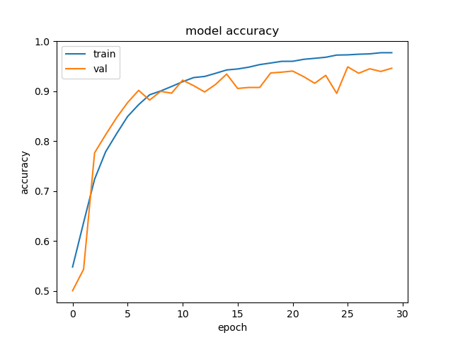
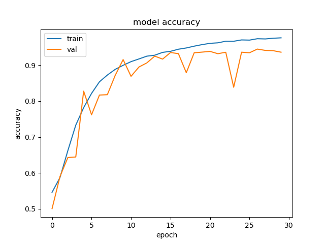

# Cat-vs-Dog-Kaggle

## TABLE OF CONTENTS
* [About the Project](#about-the-project)
* [Installation](#installation)
  * Git
    * for MacOS https://www.atlassian.com/git/tutorials/install-git#mac-os-x
    * for Windows https://www.atlassian.com/git/tutorials/install-git#windows
    * for Linux https://www.atlassian.com/git/tutorials/install-git#linux
  * Cloning the repository
  * Download Pycharm IDE
* [Usage](#usage)
* [Development Summary](#development-summary)
* [Final Model](#final-model)
* [References](#references)

## About The Project
This project was created after completion of the Deep Learning by deeplearning.ai on Coursera specialization in order to apply the learned concepts and techniques from the Convolutional Neural Network course. [More details on development process here.](#development-summary)

## Installation
Git
* for MacOS https://www.atlassian.com/git/tutorials/install-git#mac-os-x
* for Windows https://www.atlassian.com/git/tutorials/install-git#windows
* for Linux https://www.atlassian.com/git/tutorials/install-git#linux

Cloning the repository  
https://docs.github.com/en/github/creating-cloning-and-archiving-repositories/cloning-a-repository

Using VS Code or Pycharm IDE  
https://code.visualstudio.com/docs/python/python-tutorial
https://www.jetbrains.com/pycharm/download/#section=mac

Setting Up Version Control in VS Code  
https://code.visualstudio.com/docs/editor/versioncontrol#_git-support

## Usage

## Development Summary 

This project began by constantly comparing and cross-referencing multiple sources in order to understand the different methods to structure the project, the different methods of implementing data preprocessing, and the reasons for deciding to use each of these methods. 

At first, the labeled training and unlabeled test images were preprocessed into 64x64 px images and saved to a train.npy and test.npy file respectively. This was done in order to perform numpy array slicing to split the training data into separate training, validation, and test sets. From models 0 through 16, the primary improvements that were made to the project workflow include the addition of a model performance plotting function, which was used to analyze bias and variance using training and validation accuracy and loss; and automatic saving for trained models and model history, which was used alongside the plots to analyze the performance of new model iterations. 

###### Model 0 ~ 7
In terms of accuracy and loss, models 0 to 7 focused on reducing bias.  
_(model 7 bias = 1.41%, variance = 20.96% | training accuracy = 98.59%, validation accuracy = 77.63%)_  

###### Model 8 & 9
Since both training accuracy and loss had begun to stagnate, models 8 and 9 focused on reducing variance. Batch normalization was added to model 9 which successfully reduced variance from 20.96% in model 7 to 8.71%.  
_(model 9 bias = 5.69%, variance = 8.71% | training accuracy = 94.31%, validation accuracy = 85.60%)_  

###### Model 10 ~ 14
Models 10 to 13 experimented with zero padding and learning rate which resulted in a reduced variance of 2.75%. The main decrease to variance occurred in model 14 after the addition of a third dense layer which achieved 0.34% variance.  
_(model 14 bias = 18.84%, variance = 0.34% | training accuracy = 81.16%, validation accuracy = 80.82%)_  

###### Model 15
Since the variance was low compared to the bias, model 15 added another conv2D block and tested the effects of same padding. The version with the additional conv2D block and without same padding overfitted the training set and produced the expected result of decreased bias and increased variance from the parameter count increase. On the other hand, because same padding uses the edge pixels more often and maintains the input shape, less information is lost when propagating the input through each conv2D layer. Therefore, the version with same padding and the additional conv2D block resulted in lowered bias and maintained a low variance.  
_(model 15 w/ same padding: bias = 16.40%, variance = 0.44% | training accuracy = 83.60%, validation accuracy = 83.16%)_  
With Same Padding             |  Without Same Padding
:-------------------------:|:-------------------------:
  |  

###### Model 16
Since increasing the number of parameters would improve the model's fit to the training set and therefore decrease bias, the number of conv2D layers were duplicated like so.  
(add sample of new conv2d block architecture here)  
_(model 16 bias = 9.75%, variance = 1.55% | training accuracy = 90.25%, validation accuracy = 88.70%)_  

After model 16, I added keras callbacks and used csvlogger to auto log the epoch, accuracy, loss, validation accuracy, and validation loss. However, csvlogger did not save the time taken for each epoch and each step like the result of `model.summary`. Therefore, along with auto logging, I implemented summary saving, and automatic loss and accuracy plot saving.

###### Model 17
At this point, each epoch of the 20 epochs took around 227 seconds which corresponded to a total of 4540 seconds which is about 75.67 minutes. To increase model iteration and analysis speed, I did some quick research on the justifications for using GPUs in deep learning and modified my workflow so that all implementation would be done on my Mac and all model training/testing would be done on my Windows PC using a GTX 970. Furthermore, each subsequent model iteration displayed less and less accuracy and loss plateauing near the ends of their training epochs and validation epochs. Thus, model 17 tested the use of tensorflow gpu and an increased epoch number.  
_(model 17 bias = 7.66%, variance = 1.58% | training accuracy = 92.34%, validation accuracy = 90.76% | avg time per epoch = 235s)  
(model 17 gpu bias = 7.65%, variance = 1.79% | training accuracy = 92.35%, validation accuracy = 90.56% | avg time per epoch = 14s)_  
* _Note that the [Model Checkpoint callback](https://www.tensorflow.org/api_docs/python/tf/keras/callbacks/ModelCheckpoint) has not yet been used when training. This callback is later added after [model 21](#model-21)._  

###### Model 18
While the previous model's loss and accuracy plots began to plateau off, the graphs still showed a slight improving trend, which indicates a need for an increased epoch number to achieve the maximum performance for a model. Fortunately, utilizing a GPU for model training significantly decreased the training time which promotes the use of a larger amount of epochs.  
_(model 18 bias = 7.14%, variance = 4.08% | training accuracy = 92.86%, validation accuracy = 88.78%)_  

###### Model 19
This model removed dropout on the conv blocks to verify the effects of dropout. 
_(model 19 bias = 1.71%, variance = 10.59% | training accuracy = 98.29%, validation accuracy = 87.70%)_  

###### Model 20
Models 17 and 18 still resulted in a relatively high bias when compared to the variance. Since increasing the number of features would help the model fit better to the training set, resulting in reduced bias, the model input shape was changed from 64x64x3 to 128x128x3.  
_(model 20 bias = 9.72%, variance = 4.32% | training accuracy = 90.28%, validation accuracy = 85.96%)_  

  
Interestingly, this increase in the number of features resulted in the opposite effect of increasing the bias instead of decreasing the bias, even when accounting for the lack of the Model Checkpoint callback.

###### Model 21
Since increasing the number of features did not provide the expected result for model 20, I tested increasing the number of parameters in the dense layers to improve the decision making of the model, which expectedly decreased the bias. Specifically, the number of units in the 1st dense layer was doubled from 256 to 512.  
_(model 21 bias = 6.17%, variance = 1.14% | training accuracy = 93.83%, validation accuracy = 92.69%)_  

At this point, I observed from the accuracy and loss plots that each models' training accuracy and loss would vary significantly even though the general trend of loss and accuracy was improving. For several models, such as model 16, there are epochs before the final epoch where the bias, variance, or both are lower. This prompted me to research methods that could eliminate this discrepancy and resulted in the utilization of the keras callback ModelCheckpoint to save the weights associated with the epoch with the lowest validation loss.  
_For model 21, the training epoch corresponding to the lowest validation loss has: (bias = 7.39%, variance = 0.32% | training accuracy = 92.61%, validation accuracy = 92.93%)_

###### Model 22
Now that the weights associated with the lowest validation loss would be saved, model 22 continued to expand upon model 21's architecture by appending another conv block before the dense layers, which resulted in lowered bias but increased variance.  
_(model 22 bias = 3.61%, variance = 2.68% | training accuracy = 96.39%, validation accuracy = 93.71%)_  

###### Model 23 
While model 22 had higher bias than variance, model 23 successfully verified that reducing the number of weights increased bias. To achieve this result, the number of activation elements in the first dense layer was halved.  
_(model 23 bias = 4.69%, variance = 1.38% | training accuracy = 95.31%, validation accuracy = 93.93%)_  

###### Model 24
Complementing the result of model 23, model 24 successfully verified that increasing the number of weights reduced bias. To achieve this result, the number of activation elements in the first dense layer of Model 22 was doubled.  
_(model 24 bias = 2.72%, variance = 2.41% | training accuracy = 97.28%, validation accuracy = 94.87%)_  

###### Model 25
Even though model 24 had higher bias than variance, model 25 increased the dropout rate to better generalize the model. Unfortunately, this produced an unexpected result of decreased bias and increased variance. Therefore, further tests are needed to determine the reasons for this discrepancy.  
_(model 25 bias = 2.67%, variance = 2.88% | training accuracy = 97.33%, validation accuracy = 94.45%)_  

## Final Model
Overall, the optimal model would be 

###### REFERENCES
https://www.kaggle.com/uysimty/keras-cnn-dog-or-cat-classification/notebook#Virtualize-Training
https://pythonprogramming.net/convolutional-neural-network-kats-vs-dogs-machine-learning-tutorial/
https://towardsdatascience.com/image-classifier-cats-vs-dogs-with-convolutional-neural-networks-cnns-and-google-colabs-4e9af21ae7a8
...
###### TLDR
...
###### TODO
- [ ] add acc alongside bias and variance (model 22 and beyond)
- [ ] finish prog summary 
- [ ] format images ``
- [ ] add sample of new conv2d block line 57
- [ ] line 69 - add link to "model 21"
